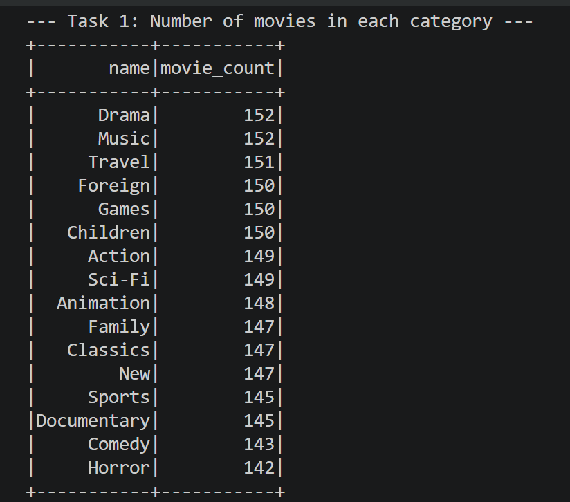
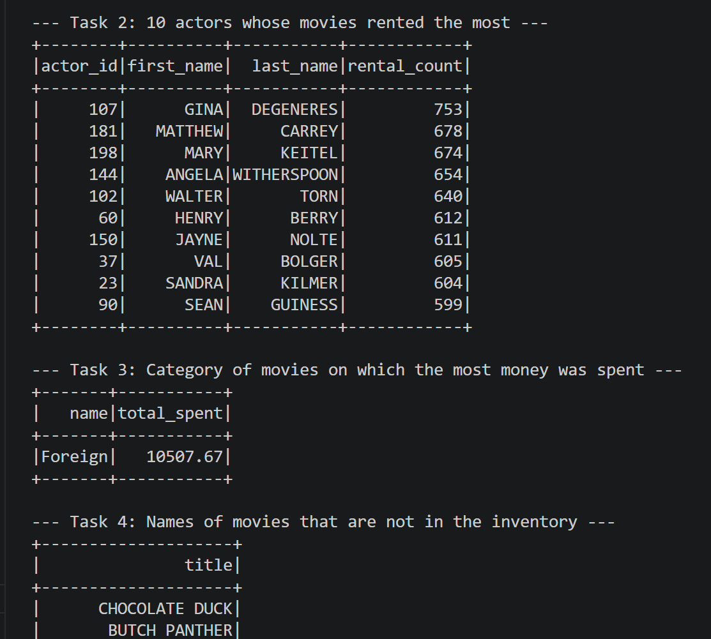

# Pagila Data Analysis with PySpark


## 🛠️ Technologies

| Layer | Tool |
|---|---|
| Engine | Apache Spark (PySpark) |
| API | Spark DataFrame API *(no SQL)* |
| Database | PostgreSQL (JDBC) |
| Environment | Docker |

---

## How to Run

### 1. Clone the Repository

```bash
git clone https://github.com/YOUR_USERNAME/YOUR_REPO_NAME.git
cd YOUR_REPO_NAME
```

### 2. Configure Database Credentials

Create a `config.py` file and fill in your own credentials:

```python
DB_URL = "jdbc:postgresql://localhost:5433/pagila"
DB_USER = "postgres"
DB_PASS = "your_password"
```

### 3. Run the Application

Launch the app via `spark-submit`, bundling the PostgreSQL JDBC driver:

```bash
spark-submit --packages org.postgresql:postgresql:42.6.0 main.py
```

---

## Tasks Accomplished

| # | Task | Description |
|---|---|---|
| 1 | **Category Analysis** | Count the number of films in each category |
| 2 | **Top Actors** | Identify the 10 actors whose films have been rented the most |
| 3 | **Revenue** | Find the film category that generated the highest total revenue |
| 4 | **Inventory Check** | Build a list of films not currently available in inventory |
| 5 | **Children Category** | Find the top 3 actors who appeared most in the *Children* category |
| 6 | **Customer Stats** | Show active vs. inactive customer counts broken down by city |
| 7 | **Pattern Search** | Analyze cities whose names start with `"a"` and contain a `"-"` character |

---

## Project Structure

```
.
├── main.py          # Entry point — runs all analysis tasks
├── config.py        # Database connection settings (not committed)
└── README.md
```

---

## Notes

- Make sure your PostgreSQL instance is running and accessible on port `5433` before launching.
- `config.py` should **not** be committed to version control. Add it to `.gitignore`.

## Result images



